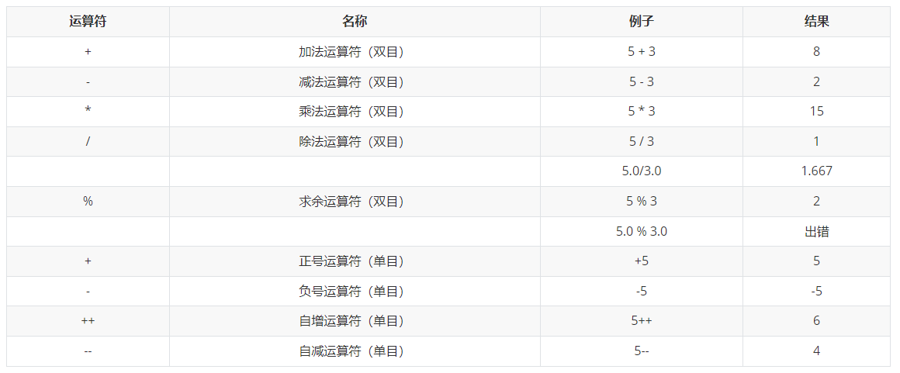
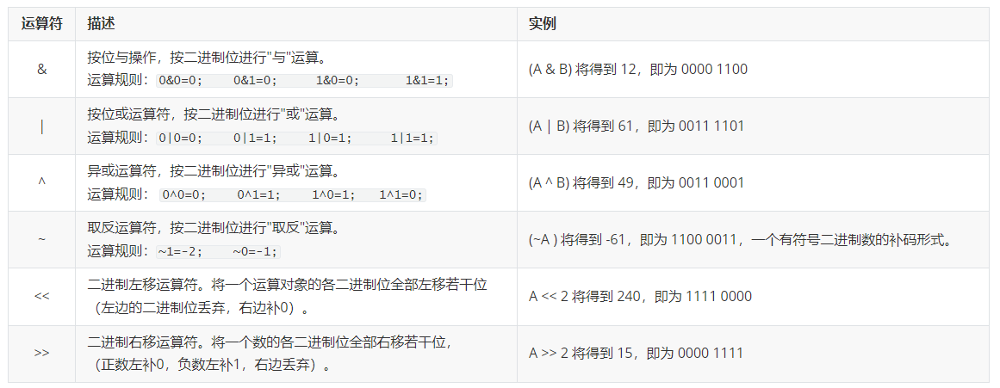
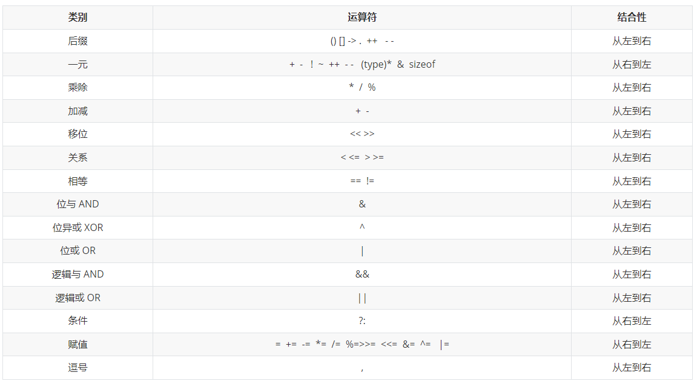

<!-- truncate -->

## 1. 基本概念
C 语言通过提供大量的运算符来支持我们对数据进行处理。运算符是一种告诉编译器执行特定的数学或逻辑操作的符号。C 语言内置了丰富的运算符，并提供了以下类型的运算符：
+ 算术运算符
+ 关系运算符
+ 逻辑运算符
+ 位运算符
+ 赋值运算符
+ 杂项运算符

## 2. 算术运算符



+ 整数间的除法会直接舍去小数部分，输出整数。
+ 浮点数间的除法则能得到一个相近结果的值（除不尽或者限定了位数）。
+ 百分号（%）则是求余数，且必须是整数才可以求余。
+ a++表示先赋值后运算，++a表示先运算再赋值，--同理。

## 3. 关系运算符

假设变量A = 10,  B = 20。则：


##  4. 逻辑运算符

假设变量A = 1,  B = 0。则：


## 5. 位运算符

位运算符作用于位，并逐位执行操作。&、| 和 ^ 的真值表如下所示：


假设A = 60 ( 0011 1100 ) ，B = 13 ( 0000 1101 )。 则：



## 6. 赋值运算符


## 7. 杂项运算符


## 8. C 语言中运算符的优先级



实际代码：

```js
#include <stdio.h>
 
int main(int argc, char const *argv[])
{
   int a = 20;
   int b = 10;
   int c = 15;
   int d = 5;
   int e;
 
   e = (a + b) * c / d;      // ( 30 * 15 ) / 5
   printf("(a + b) * c / d 的值是 %d\n",  e );
 
   e = ((a + b) * c) / d;    // (30 * 15 ) / 5
   printf("((a + b) * c) / d 的值是 %d\n" ,  e );
 
   e = (a + b) * (c / d);   // (30) * (15/5)
   printf("(a + b) * (c / d) 的值是 %d\n",  e );
 
   e = a + (b * c) / d;     //  20 + (150/5)
   printf("a + (b * c) / d 的值是 %d\n" ,  e );
  
   return 0;
}
```
